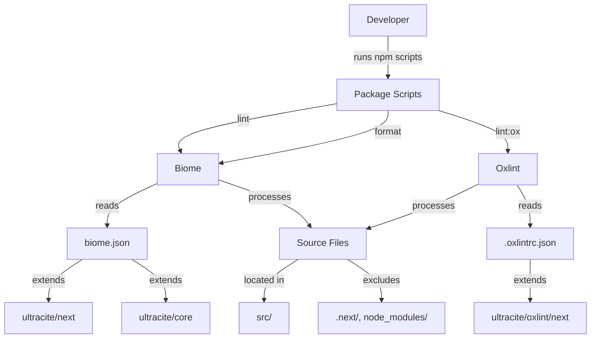

# Design Document: Ultracite and Oxlint Setup

## Overview

This design outlines the installation and configuration of ultracite and oxlint for a Next.js TypeScript project. The solution integrates two complementary linting approaches:

1. **Biome with ultracite presets**: Provides strict, opinionated formatting and linting rules
2. **Oxlint**: Offers high-performance linting with Next.js-specific rules

The design leverages ultracite's pre-configured presets to minimize manual configuration while ensuring comprehensive code quality enforcement. Both tools will coexist with the existing ESLint setup, with Biome serving as the primary formatter and linter.

### Key Design Decisions

- **Use ultracite's preset system**: Rather than manually configuring hundreds of rules, we extend ultracite's curated configurations
- **Biome as primary tool**: Biome handles both formatting and linting with a single tool
- **Oxlint for supplementary checks**: Oxlint provides additional Next.js-specific linting at high speed
- **Preserve ESLint**: Keep existing ESLint configuration for compatibility, but prioritize Biome/oxlint in scripts

## Architecture

### Component Overview



### Configuration Flow

1. **Installation Phase**: Install ultracite and oxlint as dev dependencies
2. **Configuration Phase**: Create configuration files that extend ultracite presets
3. **Script Setup Phase**: Update package.json scripts for convenient execution
4. **Validation Phase**: Run linters to verify configuration

## Components and Interfaces

### 1. Package Dependencies

**Purpose**: Manage required npm packages

**Dependencies to Install**:
- `ultracite@^7.1.2`: Provides strict linting presets
- `oxlint@^1.0.0`: High-performance linter
- `@biomejs/biome@^2.3.13`: Already installed, used by ultracite

**Installation Command**:
```bash
npm install --save-dev ultracite oxlint
```

### 2. Biome Configuration File

**File**: `biome.json`

**Purpose**: Configure Biome formatter and linter with ultracite presets

**Structure**:
```json
{
  "$schema": "https://biomejs.dev/schemas/1.9.4/schema.json",
  "extends": ["ultracite/core", "ultracite/next"],
  "vcs": {
    "enabled": true,
    "clientKind": "git",
    "useIgnoreFile": true,
    "defaultBranch": "main"
  }
}
```

**Key Configuration Elements**:
- **extends**: Inherits ultracite's core and Next.js-specific rules
- **vcs**: Enables Git integration for respecting .gitignore
- **Schema reference**: Provides IDE autocomplete and validation

**Inherited Rules from ultracite/core**:
- Formatter: 2-space indentation, 80-char line width, semicolons, LF line endings
- Linter: 200+ strict rules across accessibility, complexity, correctness, performance, security, and style
- Auto-fixes: Unused imports, sorted imports, sorted attributes
- File ignores: Build outputs, generated files, node_modules

**Inherited Rules from ultracite/next**:
- Next.js-specific rules: noImgElement, noHeadElement, noDocumentImportInPage
- Overrides for Next.js patterns: Disable useAwait warnings in async components and config files

### 3. Oxlint Configuration File

**File**: `.oxlintrc.json`

**Purpose**: Configure oxlint with Next.js-specific rules

**Structure**:
```json
{
  "$schema": "https://oxc.rs/schemas/oxlintrc.json",
  "extends": ["ultracite/oxlint/next"],
  "plugins": ["nextjs"],
  "rules": {}
}
```

**Key Configuration Elements**:
- **extends**: Inherits ultracite's Next.js oxlint configuration
- **plugins**: Enables Next.js-specific linting rules
- **rules**: Empty object allows for future custom rule additions

**Inherited Configuration**:
- Next.js plugin enabled
- Overrides for next-env.d.ts to disable import warnings

### 4. Package Scripts

**File**: `package.json` (scripts section)

**Purpose**: Provide convenient commands for linting and formatting

**Script Definitions**:

```json
{
  "scripts": {
    "lint": "biome check .",
    "lint:ox": "oxlint .",
    "format": "biome check --write .",
    "check": "biome check . && oxlint .",
    "typecheck": "tsc --noEmit"
  }
}
```

**Script Descriptions**:
- **lint**: Runs Biome linter and formatter checks without modifying files
- **lint:ox**: Runs oxlint for supplementary fast linting
- **format**: Runs Biome with auto-fix enabled (formats and fixes linting issues)
- **check**: Runs both Biome and oxlint for comprehensive validation
- **typecheck**: Existing script, runs TypeScript type checking

### 5. Integration with Existing Tools

**ESLint Relationship**:
- The project currently has `eslint.config.mjs` with Next.js presets
- Biome and ESLint can coexist, but Biome should be the primary tool
- Consider: Keep ESLint for IDE integration, use Biome for CLI/CI

**Stylelint Relationship**:
- Biome handles CSS formatting and linting
- Existing `.stylelintignore` can remain for backward compatibility
- Ultracite's Biome config includes comprehensive CSS rules

## Data Models

### Configuration File Schema

**Biome Configuration**:
```typescript
interface BiomeConfig {
  $schema: string;
  extends: string[];
  vcs?: {
    enabled: boolean;
    clientKind: "git" | "hg";
    useIgnoreFile: boolean;
    defaultBranch: string;
  };
  // Additional overrides can be added as needed
}
```

**Oxlint Configuration**:
```typescript
interface OxlintConfig {
  $schema: string;
  extends: string[];
  plugins: string[];
  rules: Record<string, unknown>;
  overrides?: Array<{
    files: string[];
    rules: Record<string, unknown>;
  }>;
}
```

### File Processing Model

**Linting Target Files**:
- **Included**: `src/**/*.{ts,tsx,js,jsx,json,css}`
- **Excluded**: `.next/`, `node_modules/`, `build/`, `dist/`, `out/`
- **Special handling**: Configuration files (*.config.*) allow default exports


## Correctness Properties

*A property is a characteristic or behavior that should hold true across all valid executions of a system—essentially, a formal statement about what the system should do. Properties serve as the bridge between human-readable specifications and machine-verifiable correctness guarantees.*

### Property 1: Configuration Files Exist and Extend Correct Presets

*For any* properly configured project, both biome.json and .oxlintrc.json SHALL exist in the project root, biome.json SHALL extend both "ultracite/core" and "ultracite/next", and .oxlintrc.json SHALL extend "ultracite/oxlint/next".

**Validates: Requirements 3.1, 3.2, 3.3, 4.1, 4.2**

### Property 2: Package Dependencies Are Correctly Installed

*For any* properly configured project, package.json SHALL include ultracite (version ≥7.1.2) and oxlint (version ≥1.0.0) in devDependencies, and the corresponding preset files SHALL be accessible in node_modules.

**Validates: Requirements 1.1, 1.2, 1.3, 2.1, 2.2, 2.3**

### Property 3: Package Scripts Execute Correct Commands

*For any* properly configured project, the package.json scripts SHALL include "lint" (running biome check), "lint:ox" (running oxlint), "format" (running biome check --write), and "check" (running both linters).

**Validates: Requirements 5.1, 5.2, 5.3, 5.4**

### Property 4: Biome Enforces Ultracite Rules

*For any* code file that violates ultracite's strict rules (e.g., using var instead of const, missing semicolons, incorrect indentation), running Biome SHALL detect and report the violations.

**Validates: Requirements 3.4**

### Property 5: Biome Formats Code Consistently

*For any* valid JavaScript/TypeScript code, running Biome format SHALL produce output with 2-space indentation, lines wrapped at 80 characters, and semicolons at statement ends.

**Validates: Requirements 3.5**

### Property 6: Oxlint Enforces Next.js Rules

*For any* Next.js code file that violates Next.js-specific rules (e.g., using  instead of next/image), running oxlint SHALL detect and report the violations.

**Validates: Requirements 4.3**

### Property 7: Linters Ignore Build Directories

*For any* configuration, the linting tools SHALL NOT process files in .next/, node_modules/, build/, dist/, or out/ directories.

**Validates: Requirements 4.4, 6.2, 6.3**

### Property 8: Linters Process Source Files

*For any* TypeScript or TSX file in the src/ directory, running the lint scripts SHALL include that file in the linting process.

**Validates: Requirements 5.5, 6.4**

### Property 9: Linters Report Errors with Context

*For any* code file with linting violations, the linter output SHALL include the file path, line number, and a description of the violation.

**Validates: Requirements 7.3**

### Property 10: Auto-fix Corrects Violations

*For any* code file with auto-fixable violations (e.g., missing semicolons, incorrect formatting), running the format command SHALL modify the file to correct the violations.

**Validates: Requirements 7.4**

### Property 11: Linters Execute Successfully on Valid Code

*For any* valid Next.js TypeScript code that follows ultracite's rules, running both Biome and oxlint SHALL complete with exit code 0 and no error messages.

**Validates: Requirements 7.1, 7.2**

## Error Handling

### Configuration Errors

**Missing Configuration Files**:
- **Error**: biome.json or .oxlintrc.json not found
- **Handling**: Linters will use default configurations or fail with clear error messages
- **Prevention**: Installation script should verify file creation

**Invalid JSON Syntax**:
- **Error**: Configuration files contain invalid JSON
- **Handling**: Linters will fail with parse error messages indicating line/column
- **Prevention**: Use schema validation in IDE, provide valid templates

**Invalid Preset References**:
- **Error**: Extended preset doesn't exist (e.g., typo in "ultracite/next")
- **Handling**: Linters will fail with "cannot resolve preset" error
- **Prevention**: Use exact preset names from ultracite documentation

### Runtime Errors

**Missing Dependencies**:
- **Error**: ultracite or oxlint not installed
- **Handling**: npm scripts will fail with "command not found" error
- **Prevention**: Verify dependencies are installed before running scripts

**File Access Errors**:
- **Error**: Cannot read source files due to permissions
- **Handling**: Linters will skip inaccessible files and report warnings
- **Prevention**: Ensure proper file permissions in project directory

**Out of Memory**:
- **Error**: Linting very large files or projects
- **Handling**: Process will exit with OOM error
- **Mitigation**: Use .gitignore patterns to exclude large generated files

### Conflict Resolution

**ESLint vs Biome Conflicts**:
- **Issue**: Different formatting rules between ESLint and Biome
- **Resolution**: Prioritize Biome rules, consider disabling ESLint formatting rules
- **Documentation**: Add comment in eslint.config.mjs noting Biome is primary formatter

**Biome vs Oxlint Conflicts**:
- **Issue**: Both tools report the same violation
- **Resolution**: This is acceptable; both tools provide complementary checks
- **Action**: No conflict resolution needed, both can run independently

## Testing Strategy

### Dual Testing Approach

This feature requires both unit tests and property-based tests to ensure comprehensive coverage:

- **Unit tests**: Verify specific configuration examples, file existence, and edge cases
- **Property tests**: Verify linting behavior across various code inputs

### Unit Testing

**Configuration Validation Tests**:
- Test that biome.json exists and contains correct extends array
- Test that .oxlintrc.json exists and contains correct extends array
- Test that package.json contains correct dependencies and scripts
- Test that configuration files have valid JSON syntax
- Test that ignored directories are properly configured

**Installation Tests**:
- Test that ultracite package is installed with correct version
- Test that oxlint package is installed with correct version
- Test that preset files exist in node_modules/ultracite/config/

**Script Execution Tests**:
- Test that "npm run lint" executes without errors on valid code
- Test that "npm run lint:ox" executes without errors on valid code
- Test that "npm run format" modifies files with formatting issues
- Test that "npm run check" runs both linters sequentially

**Edge Cases**:
- Test behavior when configuration files are missing
- Test behavior when dependencies are not installed
- Test behavior with empty source directories
- Test behavior with files that have no violations

### Property-Based Testing

**Testing Library**: Use a property-based testing library appropriate for the validation scripts (e.g., fast-check for JavaScript/TypeScript)

**Test Configuration**: Each property test should run a minimum of 100 iterations

**Property Test Implementations**:

**Property 1 Test**: Configuration Files Exist and Extend Correct Presets
- **Tag**: Feature: ultracite-oxlint-setup, Property 1: Configuration files exist and extend correct presets
- **Generator**: N/A (single configuration to check)
- **Test**: Parse biome.json and .oxlintrc.json, verify extends arrays contain expected values
- **Assertion**: Files exist, JSON is valid, extends arrays are correct

**Property 2 Test**: Package Dependencies Are Correctly Installed
- **Tag**: Feature: ultracite-oxlint-setup, Property 2: Package dependencies are correctly installed
- **Generator**: N/A (single package.json to check)
- **Test**: Parse package.json, verify ultracite and oxlint in devDependencies with correct versions
- **Assertion**: Dependencies exist with version constraints satisfied

**Property 3 Test**: Package Scripts Execute Correct Commands
- **Tag**: Feature: ultracite-oxlint-setup, Property 3: Package scripts execute correct commands
- **Generator**: N/A (single package.json to check)
- **Test**: Parse package.json scripts section, verify each script contains expected command
- **Assertion**: All required scripts exist with correct commands

**Property 4 Test**: Biome Enforces Ultracite Rules
- **Tag**: Feature: ultracite-oxlint-setup, Property 4: Biome enforces ultracite rules
- **Generator**: Generate code samples that violate specific ultracite rules (var usage, missing semicolons, wrong indentation, etc.)
- **Test**: Run Biome on generated code, capture output
- **Assertion**: Biome reports violations for each generated rule violation

**Property 5 Test**: Biome Formats Code Consistently
- **Tag**: Feature: ultracite-oxlint-setup, Property 5: Biome formats code consistently
- **Generator**: Generate valid code with varying formatting (different indentation, line lengths, semicolon presence)
- **Test**: Run Biome format, analyze output
- **Assertion**: Output has 2-space indentation, 80-char lines, semicolons present

**Property 6 Test**: Oxlint Enforces Next.js Rules
- **Tag**: Feature: ultracite-oxlint-setup, Property 6: Oxlint enforces Next.js rules
- **Generator**: Generate Next.js code samples that violate Next.js-specific rules (img tags, head elements, etc.)
- **Test**: Run oxlint on generated code, capture output
- **Assertion**: Oxlint reports violations for each generated Next.js rule violation

**Property 7 Test**: Linters Ignore Build Directories
- **Tag**: Feature: ultracite-oxlint-setup, Property 7: Linters ignore build directories
- **Generator**: Create test files in ignored directories (.next/, node_modules/, etc.)
- **Test**: Run linters, check which files were processed
- **Assertion**: No files from ignored directories appear in linter output

**Property 8 Test**: Linters Process Source Files
- **Tag**: Feature: ultracite-oxlint-setup, Property 8: Linters process source files
- **Generator**: Generate TypeScript/TSX files in src/ directory with known violations
- **Test**: Run linters, check output for file paths
- **Assertion**: All generated src/ files appear in linter output

**Property 9 Test**: Linters Report Errors with Context
- **Tag**: Feature: ultracite-oxlint-setup, Property 9: Linters report errors with context
- **Generator**: Generate code files with various violations at different line numbers
- **Test**: Run linters, parse error output
- **Assertion**: Each error includes file path, line number, and violation description

**Property 10 Test**: Auto-fix Corrects Violations
- **Tag**: Feature: ultracite-oxlint-setup, Property 10: Auto-fix corrects violations
- **Generator**: Generate code with auto-fixable violations (formatting issues, missing semicolons, etc.)
- **Test**: Run format command, read modified files
- **Assertion**: All auto-fixable violations are corrected in the output

**Property 11 Test**: Linters Execute Successfully on Valid Code
- **Tag**: Feature: ultracite-oxlint-setup, Property 11: Linters execute successfully on valid code
- **Generator**: Generate valid Next.js TypeScript code that follows all ultracite rules
- **Test**: Run both Biome and oxlint, capture exit codes
- **Assertion**: Both linters exit with code 0, no errors in output

### Integration Testing

**End-to-End Workflow Tests**:
- Test complete installation and configuration process
- Test running all linting scripts in sequence
- Test that formatted code passes linting checks
- Test that the project builds successfully after configuration

### Continuous Integration

**CI Pipeline Integration**:
- Add lint check to CI pipeline: `npm run check`
- Add format check to CI pipeline: `npm run lint` (without --write)
- Add type check to CI pipeline: `npm run typecheck`
- Fail CI build if any check fails

**Pre-commit Hooks** (Optional):
- Consider adding lint-staged with Biome for pre-commit formatting
- Run oxlint on staged files before commit
